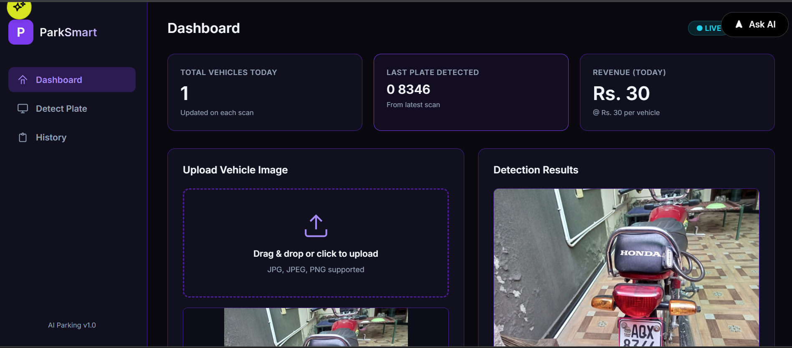
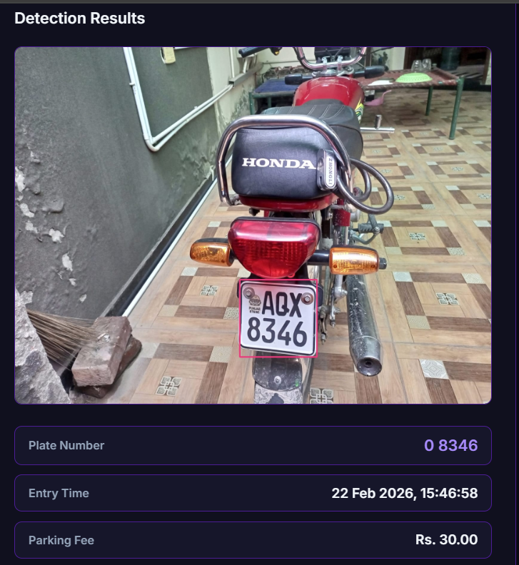
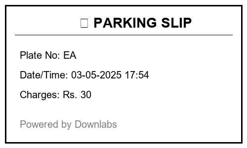

# Smart Parking Management System

A modern, AI-powered parking management system that automatically detects and reads vehicle license plates using YOLO V11 and generates professional parking slips. Powered by Downlabs.

## Overview

This system leverages state-of-the-art computer vision technologies to streamline parking operations. It automatically detects license plates from vehicle images, extracts the plate number using OCR, and generates premium-quality parking slips with proper branding and timestamps.

## Features

- **Automatic License Plate Detection**: Uses YOLO V11 model for accurate and fast license plate detection
- **OCR Text Recognition**: Extracts license plate numbers using EasyOCR with high accuracy
- **Premium Parking Slip Generation**: Creates professional, branded parking slips with Downlabs logo
- **Dual Interface**: Available as both web application (Flask) and interactive application (Streamlit)
- **Real-time Processing**: Fast detection and slip generation
- **Clean UI**: Modern, responsive interface with gradient designs
- **Timestamp Recording**: Automatically records entry date and time
- **Image Export**: Saves generated parking slips as high-quality images

## Technologies Used

### Machine Learning & Computer Vision
- **YOLO V11 (Ultralytics)**: Deep learning model for object detection
- **EasyOCR**: Optical Character Recognition for text extraction
- **PyTorch**: Deep learning framework
- **OpenCV**: Computer vision library for image processing

### Backend & Web Framework
- **Flask**: Web application framework
- **Streamlit**: Interactive web application framework

### Image Processing
- **Pillow (PIL)**: Image manipulation and generation
- **NumPy**: Numerical computing for array operations

### Frontend
- **HTML5/CSS3**: Modern web interface
- **JavaScript**: Interactive functionality

## Installation

### Prerequisites

- Python 3.8 or higher
- CUDA-capable GPU (recommended for faster processing)
- Git

### Setup Instructions

1. **Clone the repository**
   ```bash
   git clone https://github.com/yourusername/smart-parking-system.git
   cd smart-parking-system
   ```

2. **Create a virtual environment**
   ```bash
   python -m venv venv
   ```

3. **Activate the virtual environment**
   - Windows:
     ```bash
     venv\Scripts\activate
     ```
   - Linux/Mac:
     ```bash
     source venv/bin/activate
     ```

4. **Install dependencies**
   ```bash
   pip install -r requirements.txt
   ```

5. **Download or place your trained YOLO model**
   - Place your `best.pt` model file in the root directory
   - Or train your own model using the YOLO V11 framework

## Usage

### Flask Web Application

1. **Start the Flask server**
   ```bash
   python app.py
   ```

2. **Access the application**
   - Open your browser and navigate to: `http://localhost:5000`

3. **Upload and Process**
   - Upload a vehicle image containing a license plate
   - The system will automatically detect the plate and generate a parking slip
   - Download the generated slip from the results page

### Streamlit Application

1. **Run the Streamlit app**
   ```bash
   streamlit run main.py
   ```

2. **Access the application**
   - The app will automatically open in your default browser
   - Or navigate to: `http://localhost:8501`

3. **Upload and Process**
   - Use the file uploader to select a vehicle image
   - Click the detection button
   - View and download the generated parking slip

## Project Structure

```
smart-parking-system/
│
├── app.py                          # Flask web application
├── main.py                         # Streamlit application
├── best.pt                         # Trained YOLO V11 model
├── requirements.txt                # Python dependencies
├── README.md                       # Project documentation
│
├── static/                         # Static assets
│   ├── css/
│   │   └── style.css              # Stylesheet for Flask app
│   ├── js/
│   │   └── main.js                # JavaScript functionality
│   ├── img/
│   │   └── downlabs logo.png      # Downlabs logo
│   ├── slips/                     # Generated parking slips
│   └── fonts/                     # Custom fonts (Poppins)
│
├── templates/
│   └── index.html                 # HTML template for Flask app
│
├── ultralyticss/                   # YOLO implementation
│   ├── models/                    # YOLO model configurations
│   ├── nn/                        # Neural network modules
│   ├── yolo/                      # YOLO core functionality
│   └── hub/                       # Model hub utilities
│
└── runs/                          # Training and detection runs
    └── detect/
        └── train/                 # Training results
```

## Model Training

If you want to train your own license plate detection model:

1. **Prepare your dataset**
   - Collect and annotate license plate images
   - Format: YOLO format (images + labels)

2. **Configure training**
   - Modify the configuration file in `ultralyticss/models/`
   - Set appropriate hyperparameters

3. **Train the model**
   ```python
   from ultralytics import YOLO
   
   model = YOLO('yolov11n.pt')
   results = model.train(
       data='your_dataset.yaml',
       epochs=100,
       imgsz=640,
       batch=16
   )
   ```

4. **Export the trained model**
   - The best model will be saved as `best.pt`
   - Place it in the root directory for inference

## API Endpoints (Flask)

### POST /detect
Detect license plate and generate parking slip

**Request:**
- Method: `POST`
- Content-Type: `multipart/form-data`
- Body: `file` (image file)

**Response:**
```json
{
  "success": true,
  "plate_number": "ABC1234",
  "timestamp": "2026-02-22 10:30:45",
  "slip_url": "/static/slips/parking_slip_20260222_103045.png",
  "confidence": 0.95
}
```

## Screenshots

### Main Dashboard


### License Plate Detection


### Generated Parking Slip


### Processing Result


## Configuration

Key configuration parameters can be modified in the application files:

### YOLO Model Settings
```python
MODEL_PATH = "best.pt"              # Path to trained model
CONFIDENCE_THRESHOLD = 0.5          # Detection confidence
```

### OCR Settings
```python
OCR_LANGUAGES = ['en']              # OCR languages
GPU_ENABLED = True                  # Use GPU for OCR
```

### Parking Slip Design
```python
FONT_BOLD = "fonts/Poppins/Poppins-Bold.ttf"
FONT_REGULAR = "fonts/Poppins/Poppins-Regular.ttf"
LOGO_PATH = "static/img/downlabs logo.png"
```

## Performance

- **Detection Speed**: ~50-100ms per image (with GPU)
- **OCR Speed**: ~200-300ms per plate
- **Total Processing Time**: <1 second per vehicle
- **Detection Accuracy**: >95% on well-lit images
- **OCR Accuracy**: >90% on clear plates

## System Requirements

### Minimum Requirements
- CPU: Intel Core i5 or equivalent
- RAM: 8GB
- Storage: 2GB free space
- OS: Windows 10/11, Linux, macOS

### Recommended Requirements
- CPU: Intel Core i7 or equivalent
- RAM: 16GB
- GPU: NVIDIA GPU with 4GB+ VRAM (CUDA support)
- Storage: 5GB free space
- OS: Windows 10/11, Linux (Ubuntu 20.04+)

## Troubleshooting

### Common Issues

**Issue: Model file not found**
```
Solution: Ensure best.pt is in the root directory
```

**Issue: CUDA out of memory**
```
Solution: Reduce batch size or use CPU inference
```

**Issue: OCR cannot detect text**
```
Solution: Ensure image is well-lit and plate is clearly visible
```

**Issue: Font not found**
```
Solution: Download Poppins font and place in fonts/ directory
```

## Future Enhancements

- Real-time video stream processing
- Multiple language support for OCR
- Database integration for parking history
- Payment gateway integration
- Mobile application
- Advanced analytics dashboard
- Automated barrier control integration
- SMS/Email notification system

## Contributing

Contributions are welcome! Please follow these steps:

1. Fork the repository
2. Create a feature branch (`git checkout -b feature/AmazingFeature`)
3. Commit your changes (`git commit -m 'Add some AmazingFeature'`)
4. Push to the branch (`git push origin feature/AmazingFeature`)
5. Open a Pull Request

## License

This project is licensed under the MIT License - see the [LICENSE](LICENSE) file for details.

## Acknowledgments

- **YOLO V11** by Ultralytics for the object detection framework
- **EasyOCR** for the OCR capabilities
- **Downlabs** for project sponsorship and branding
- Open-source community for various tools and libraries


